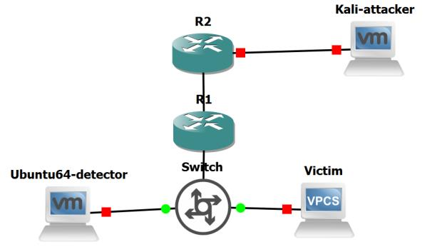

# Étude et déploiement d'une solution IDS : Snort et Suricata

Projet académique consacré à l'étude, au déploiement et à la comparaison de deux solutions open source de détection d'intrusions : **Snort** et **Suricata**.

L'objectif est de mettre en place un environnement réseau virtualisé permettant de générer différents types de trafic et d'observer la capacité des IDS à identifier des activités potentiellement malveillantes.

## Objectifs

- Comprendre le fonctionnement d'un système de détection d'intrusions (IDS).
- Déployer et configurer Snort et Suricata.
- Concevoir un environnement de test sous GNS3.
- Écrire et configurer des règles de détection personnalisées.
- Générer différents scénarios réseau depuis Kali Linux.
- Observer et analyser les alertes générées.
- Comparer qualitativement le comportement de Snort et Suricata.

## Architecture du laboratoire

L'environnement de test repose sur **GNS3** et comprend notamment :

- une machine **Kali Linux** utilisée pour générer le trafic de test ;
- une machine **Ubuntu** hébergeant les solutions IDS ;
- une machine cible ;
- des équipements réseau virtualisés ;
- une configuration **SPAN** permettant de transmettre une copie du trafic réseau vers le système de détection.



## Technologies utilisées

- **Snort**
- **Suricata**
- **GNS3**
- **Kali Linux**
- **Ubuntu Linux**
- **Nmap**
- **Wireshark / analyse réseau**
- **LaTeX**

## Mise en œuvre

### Snort

Snort est installé et configuré sur la machine de détection. La configuration comprend notamment la définition du réseau surveillé et l'utilisation de règles permettant de générer des alertes sur certains comportements observés dans le laboratoire.

Des règles personnalisées sont également utilisées afin d'adapter la détection aux scénarios étudiés.

### Suricata

Suricata est déployé dans le même environnement afin d'étudier son fonctionnement et de comparer les alertes obtenues avec celles de Snort.

La configuration repose notamment sur `suricata.yaml` ainsi que sur des règles de détection locales.

## Scénarios de test

Plusieurs scénarios sont réalisés depuis Kali Linux afin de générer du trafic observable par les IDS :

- trafic ICMP ;
- envoi intensif de paquets ICMP ;
- scans réseau avec Nmap ;
- utilisation de règles personnalisées pour identifier certains comportements.

Les alertes générées par Snort et Suricata sont ensuite observées et analysées.

## Résultats

Les expérimentations réalisées dans l'environnement GNS3 permettent d'observer la génération d'alertes par Snort et Suricata face aux différents scénarios étudiés.

Le projet permet également de comparer leur configuration, leur fonctionnement et la manière dont les événements de sécurité sont présentés à l'administrateur.

Les résultats détaillés et les captures des expérimentations sont disponibles dans le rapport.

## Rapport

Le rapport complet du projet est disponible ici :

**[Consulter le rapport IDS](rapport-IDS.pdf)**

Le document est également fourni sous forme de projet LaTeX afin de faciliter sa consultation et sa modification.

## Compilation LaTeX

Sur **Overleaf** :

1. importer le contenu du dépôt ;
2. sélectionner `main.tex` comme document principal ;
3. utiliser **pdfLaTeX** ;
4. compiler le document.

En local avec une distribution TeX Live :

```bash
latexmk -pdf -interaction=nonstopmode -halt-on-error main.tex
```

## Structure du projet

```text
.
├── main.tex
├── sections/
│   ├── 01-introduction.tex
│   ├── 02-etat-art.tex
│   ├── 03-implementation.tex
│   ├── 04-analyse-conclusion.tex
│   ├── 05-annexes.tex
│   └── 06-bibliographie.tex
├── images/
├── rapport-IDS.pdf
├── README.md
└── .gitignore
```

## Auteurs

**Ahmed Chegueni**  
**Taher Bazzi**

Projet académique réalisé dans le cadre d'une formation en Informatique et Réseaux.
